# .NET MAUI goodlooking UI Samples 

A curated list of awesome **.NET MAUI** open source samples to show how to create **goodlooking UI** with .NET.

Contributions are always welcome!

## [MAUIsland](https://github.com/Strypper/mauisland)

Made for the .NET MAUI Beautiful UI Challenge

## Images Preview

## Platforms
iOS, Android, WinUI and Tizen

## Features
- Controls galleries
- MVVM
- Toolkit
- Syncfusion
- SignalR

## More Information
- Author: [Strypper Vandel Jason](https://github.com/Strypper)
- Source Code: https://github.com/Strypper/mauisland

## [SpaceX History](https://github.com/EduardoReisDev/SpaceXhistory)

Made for the .NET MAUI Beautiful UI Challenge

## Images Preview

## Platforms
iOS and Android

## Features
- REST API
- ListView
- MVVM

## More Information
- Author: [Eduardo Reis](https://github.com/EduardoReisDev)
- Source Code: https://github.com/EduardoReisDev/SpaceXhistory

# MAUIPETS
Project for .NET MAUI CHALLENGE, MAUIPETS is a demo Adoption Pet App.
#[ MAUIPETS](https://github.com/BryanOroxon/MAUIPETS " MAUIPETS")

------------
## PlatformsPlatforms
-  Android
- iOS
- Mac Catalist
- Windows

### Features

- API REST
- BORDERS
- COLLECTION VIEW
- COMMUNITY TOOLKIT MVVM
- FRAMES
- SHADOWS
- SHAPES

## Images Preview

## More information:
- Author: [Bryan Oroxon](https://github.com/BryanOroxon "Bryan Oroxon")
- Source code:[ https://github.com/BryanOroxon/MAUIPETS](https://github.com/BryanOroxon/MAUIPETS " https://github.com/BryanOroxon/MAUIPETS")

## [News App](https://github.com/henduck/MAUINewsApp)

Made for the .NET MAUI Beautiful UI Challenge

Based on [this design](https://dribbble.com/shots/15607170-News-App-Mobile-Concept) by [Aan Ragil](https://dribbble.com/aanragilj)

## Platforms
iOS and Android

## Features
- FlexLayout
- BindableLayout
- CollectionView
- MVVM
- Shell Navigation

## More Information
- Author: [Jesse Smith](https://github.com/henduck)
- Source Code: https://github.com/henduck/MAUINewsApp

## [Crypto Tracker App](https://docs.telerik.com/devtools/maui/demos-and-sample-apps/crypto-app)

The Crypto Tracker App is a demo application built with .NET MAUI & Telerik UI for .NET MAUI components, showcasing real-time changes in cryptocurrency prices.

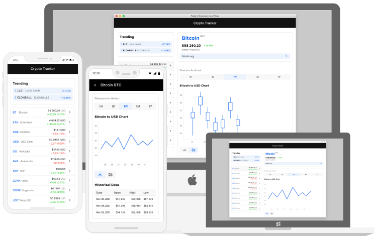

### Platforms

Android, iOS, macOS and Windows.

### Features:

* Uses latest .NET MAUI & .NET 6 runtime
* Caters to mobile & desktop UX differently
* Showcases polished & performant UI like ListView, Charts etc.

### More information:
- [App Source Code](https://github.com/telerik/maui-samples/tree/main/Samples/CryptoTracker)
- [Telerik UI for .NET MAUI](https://www.telerik.com/maui-ui)

## [Todo.me](https://github.com/behl1anmol/Todo.me)
Todo.me is a simple note taking and task tracking app made with .NET MAUI.

### Platforms

- [x] Android
- [?] Windows (Work in progress)

## Features
* Lottie Animations
* Randomly set backgroung color for every Todo item
* ColletionView
* SwipeView
* MVVM
* Borders

## Preview
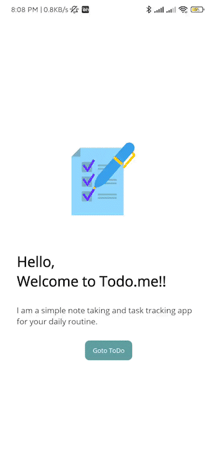 &nbsp;&nbsp;&nbsp; 
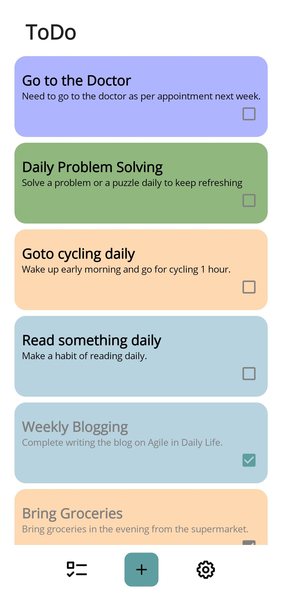 &nbsp;&nbsp;&nbsp; 
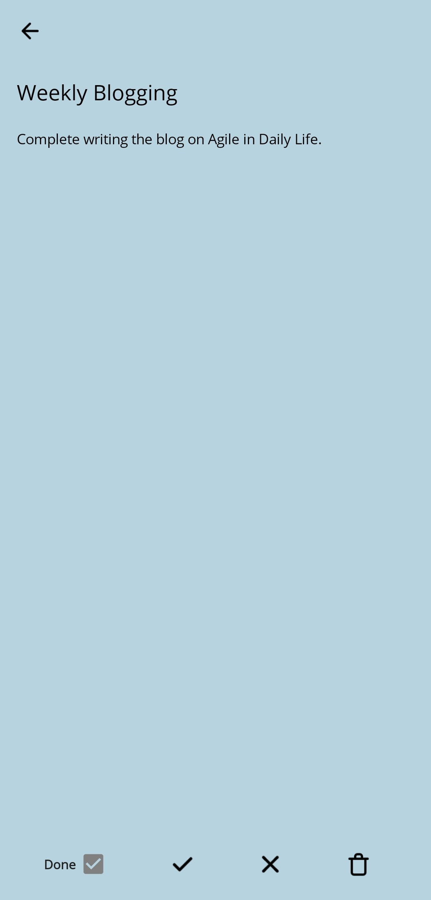  

### More information
- Author: [Anmol Behl](https://github.com/behl1anmol)
- Source code: [https://github.com/behl1anmol/Todo.me](https://github.com/behl1anmol/Todo.me)
- Future planned features:
	* Integrating Agile Methodology to better manage daily routine
	* iOS Support

## [Mitawi Weather App](https://github.com/danielmonettelli/netmaui-mitawi-app-challenge)

Mitawi App UI/UX Challenge made with .NET MAUI.

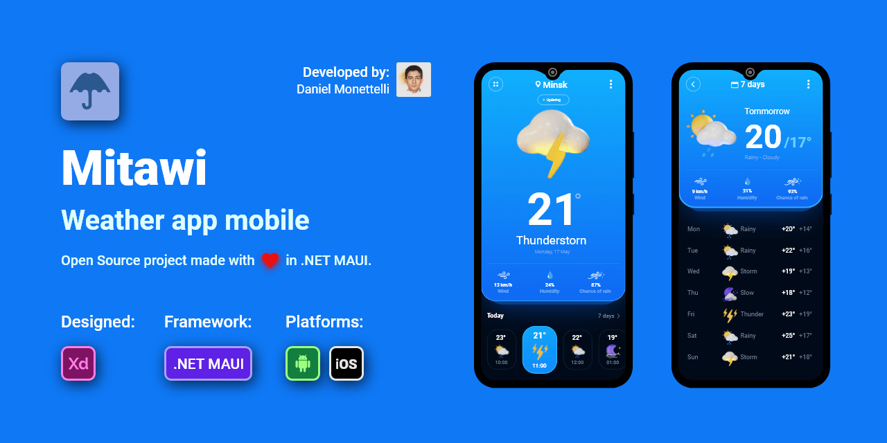

Inspired on this [design](https://dribbble.com/shots/15661680-Weather-App) by [Vitaliy Dorozhko](https://dribbble.com/Offdesignarea).

### Platforms

Android, iOS.

### Features:

* Use all new .NET MAUI APIs: Startup, HostBuilder, etc.
* Harmony in portrait and landscape orientations.
* Geolocation.
* Geocoding.
* Converters.
* .NET MAUI Community Toolkit.
* MVVM Community Toolkit.
* Sentry.Maui (Error & Performance Monitoring).
* System.Text.Json.
* System.Net.Http.
* Visual State Manager.
* OnScreenSizeMarkup.
* BindableLayout.
* Border.
* Shadow.
* Linear gradient brushes.
* Shapes.
* Multi-bindings.

### More information:
- Author: [Daniel Monettelli](https://github.com/danielmonettelli)
- English publication: [Migration from Mitawi to .NET MAUI](https://danielmonettelli.github.io/posts/migrating-mitawi-to-net-maui/)
- Spanish publication: [Migrando Mitawi a .NET MAUI](https://dev.to/danielmonettelli/migrando-mitawi-a-net-maui-25ij)
- Source code: [https://github.com/danielmonettelli/netmaui-mitawi-app-challenge](https://github.com/danielmonettelli/netmaui-mitawi-app-challenge)

## [Ecommerce Design](https://github.com/exendahal/EcommerceMAUI)
Ecommerce design with NET MAUI (MVVM Pattern)

## Features
* ColletionView
* SwipeView
* MVVM
* Font Icon
* Borders
* Color gradient brushes
* Stepper

## Preview
 &nbsp;&nbsp;&nbsp; 
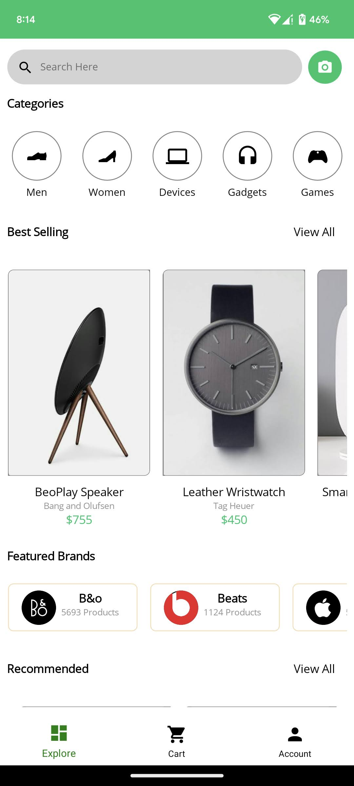 &nbsp;&nbsp;&nbsp; 
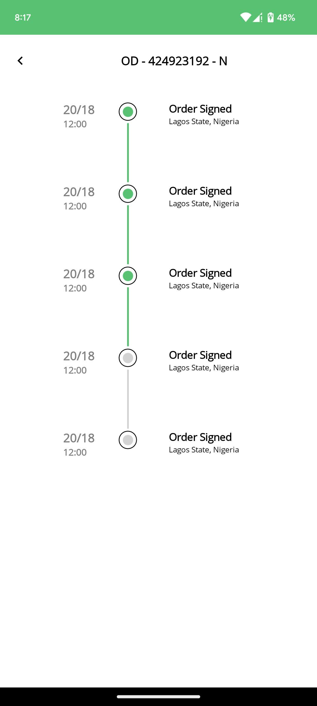  

### More information
- Author: [Santosh Dahal](https://github.com/exendahal)
- Source code: [https://github.com/exendahal/EcommerceMAUI](https://github.com/exendahal/EcommerceMAUI)

## [Beautyshop App](https://github.com/jsuarezruiz/netmaui-beautyshop-app-challenge)

Beautyshop App UI Challenge made with .NET MAUI. 

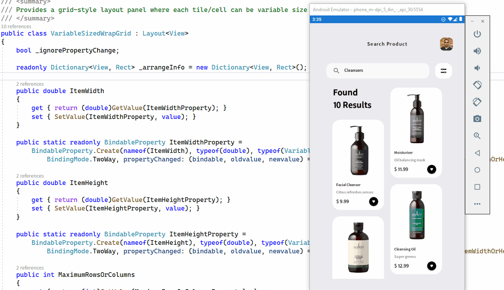

Based on this [design](https://dribbble.com/shots/15487383-Beauty-Product-Shop-App) by [Mahmudur Rahman](https://dribbble.com/MahmuduR).

### Platforms

Android, iOS, macOS and Windows.

### Features:

* Use all new .NET MAUI APIs: Startup, HostBuilder, etc.
* Create a new custom Layout.
* BindableLayout.

### More information:
- Author: [Javier Suárez](https://github.com/jsuarezruiz)
- Source code: [https://github.com/jsuarezruiz/netmaui-beautyshop-app-challenge](https://github.com/jsuarezruiz/netmaui-beautyshop-app-challenge)

## [Maui Planets](https://github.com/naweed/MauiPlanets)

Planets Mobile App UI built using .Net Maui. Implements the [Dribbble design](https://dribbble.com/shots/15592060-Planet-Mobile-App)

You can read about implementation of this design in [Part 1](https://blogs.xgenoapps.com/post/2022/07/08/maui-planets) and [Part 2](https://blogs.xgenoapps.com/post/2022/07/15/maui-planets-part-2) of the blog series.

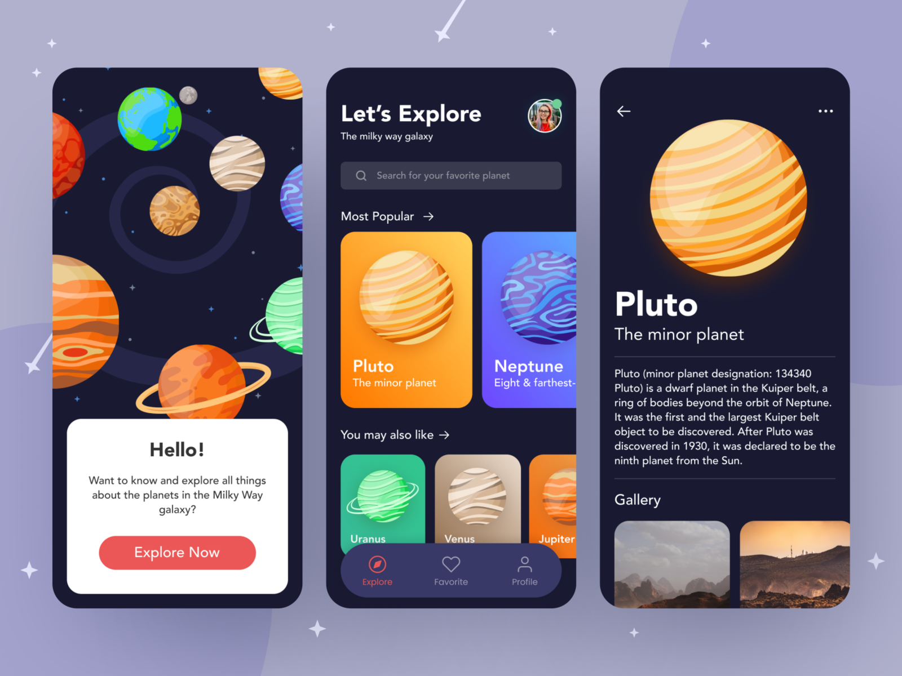

### Platforms

- [x] iOS
- [x] Android

### Features:

* Use all new .NET MAUI APIs: Startup, HostBuilder, etc.
* Animations.
* Border

### More information:
- Author: [Naweed Akram](https://github.com/naweed)
- Blog post: [.NET MAUI Travels to the space](https://blogs.xgenoapps.com/post/2022/07/08/maui-planets)
- Source code: [https://github.com/naweed/MauiPlanets](https://github.com/naweed/MauiPlanets)

## [Pet Adoption UI](https://github.com/LeomarisReyes/PetAdoptionUI)

Pet Adoption UI is a replica made in .NET MAUI. Design obtained from Dribble: https://dribbble.com/shots/9794301-Pet-Adoption-App

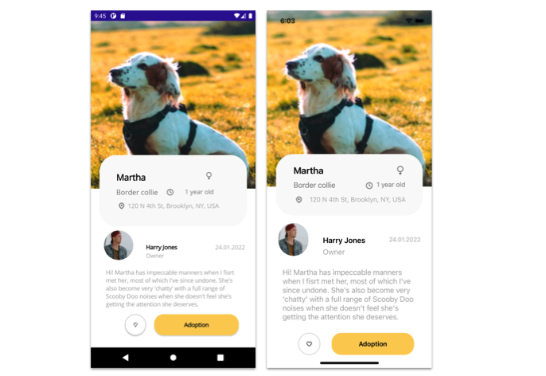

### Platforms

Android, iOS, macOS and Windows.

### Features:

* Use all new .NET MAUI APIs: Startup, HostBuilder, etc.
* Layouts.

### More information:
- Author: [Leomaris Reyes](https://github.com/LeomarisReyes)
- Blog post: [Replicating Pet Adoption UI in .NET MAUI](https://askxammy.com/replicating-pet-adoption-ui-in-net-maui/)
- Source code: [https://github.com/LeomarisReyes/PetAdoptionUI](https://github.com/LeomarisReyes/PetAdoptionUI)

## [F1TV](https://github.com/andreas-nesheim/MAUIUIJuly)

F1TV app clone made with .NET MAUI.

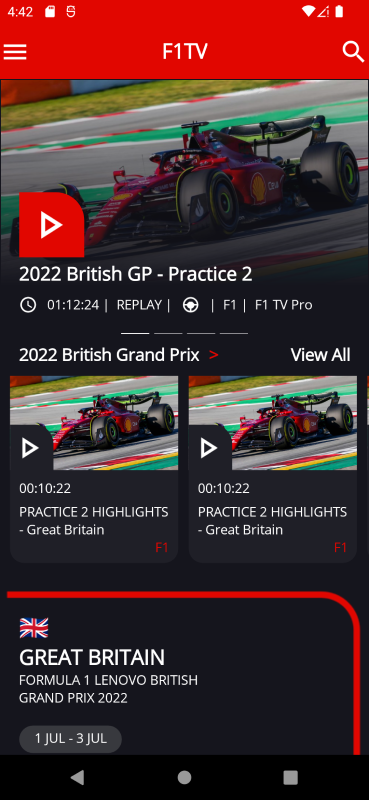

### Platforms

Android, iOS, macOS and Windows.

### Features:

* Use all new .NET MAUI APIs: Startup, HostBuilder, etc.
* CollectionView.
* Border.

### More information:
- Author: [Andreas Nesheim](https://github.com/andreas-nesheim)
- Blog post: [MAUI UI July – Replicating F1TV app](https://www.andreasnesheim.no/maui-ui-july-replicating-f1tv-app/)
- Source code: [https://github.com/andreas-nesheim/MAUIUIJuly](https://github.com/andreas-nesheim/MAUIUIJuly)

## [ScientificCalculator](https://github.com/naweed/MauiScientificCalculator)

A simple scientific calculator built uisng .NET MAUI Preview 14. Based ont his [Behance Concept](https://www.behance.net/gallery/79810231/UIUX-Challenge-04-05-Calculator-App-Icon).

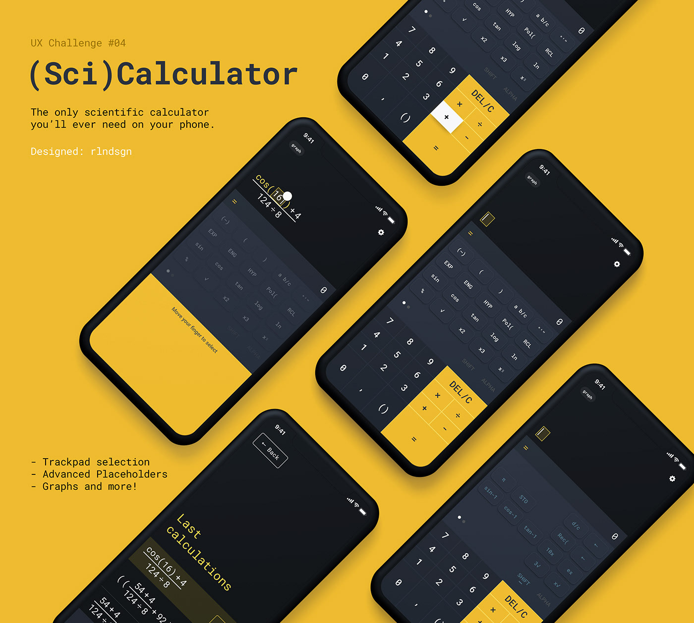

### Platforms

- [x] iOS
- [x] Android
- [x] Windows

### Features:

* Use all new .NET MAUI APIs: Startup, HostBuilder, etc.
* Shadows.

### More information:
- Author: [Naweed Akram](https://github.com/naweed)
- Source code: [https://github.com/naweed/MauiScientificCalculator](https://github.com/naweed/MauiScientificCalculator)

## [ChatApp](https://github.com/jsuarezruiz/netmaui-chat-app-challenge)

Chat App UI Challenge made with .NET MAUI. Based on this [design](https://dribbble.com/shots/11470136-A-Messaging-App-Concept) by [Tannaz Sadeghi](https://dribbble.com/tannazsadeghi).

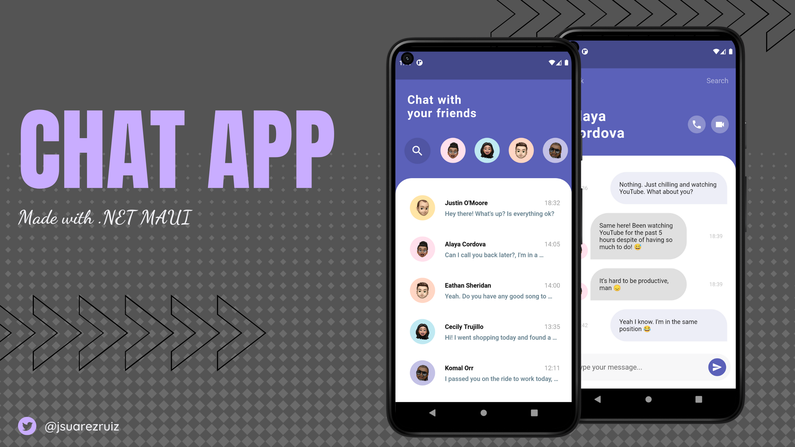

### Platforms

Android, iOS, macOS and Windows.

### Features:

* Use all new .NET MAUI APIs: Startup, HostBuilder, etc.
* DataTemplateSelector.

### More information:
- Author: [Javier Suárez](https://github.com/jsuarezruiz)
- Source code: [https://github.com/jsuarezruiz/netmaui-chat-app-challenge](https://github.com/jsuarezruiz/netmaui-chat-app-challenge)

## [.NET Podcasts](https://github.com/microsoft/dotnet-podcasts)

.NET Podcast App is a sample application showcasing .NET 6, ASP.NET Core, Blazor, .NET MAUI, Azure Container Apps, and more.

### Platforms

Android, iOS, macOS and Windows.

### Features:

* Use all new .NET MAUI APIs: Startup, HostBuilder, etc.
* Microsoft.Maui.Essentials

### More information:
- Source code: [https://github.com/microsoft/dotnet-podcasts](https://github.com/microsoft/dotnet-podcasts)

## [WeatherTwentyOne](https://github.com/davidortinau/WeatherTwentyOne)

This is a [.NET MAUI](https://github.com/dotnet/maui) app showcasing .NET 6 Previews progress. For more information about what's included, read the [release blog post](https://devblogs.microsoft.com/dotnet/announcing-net-maui-preview-4).

### Platforms

Android, iOS, macOS and Windows.

### Features:

* Use .NET 6 latest Preview
* Use all new .NET MAUI APIs: Startup, HostBuilder, etc.
* Microsoft.Maui.Essentials

### More information:
- Source code: [https://github.com/davidortinau/WeatherTwentyOne](https://github.com/davidortinau/WeatherTwentyOne)

## [MAUI Finance](https://github.com/cemahseri/MauiFinance)

UI built in .NET MAUI, based on [a Dribbble design](https://dribbble.com/shots/14210557-Finance-Mobile-Application-UX-UI-Design).

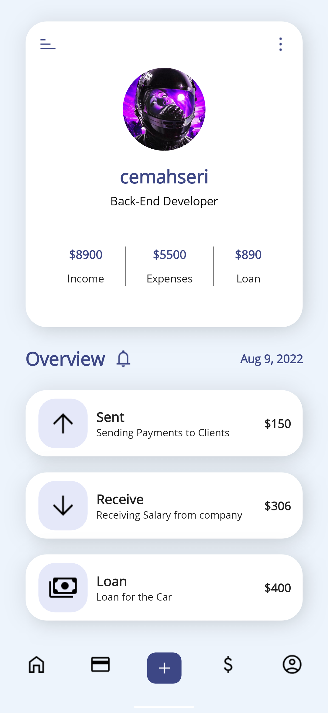

### Platforms

Android and iOS.

### Features:

* Use all new .NET MAUI APIs: Startup, HostBuilder, Handlers etc.
* ControlTemplate
* Borders

### More information:
- Author: [Yunus Emre AYGÜN](https://github.com/cemahseri)
- Source code: [https://github.com/cemahseri/MauiFinance](https://github.com/cemahseri/MauiFinance)

## [MAUI Starbucks Redesign](https://github.com/sattasundar/maui-starbucks-ui)

UI built in .NET MAUI, based on [a Uplabs](https://www.uplabs.com/posts/starbucks-app-redesign-uplabs-challenge).

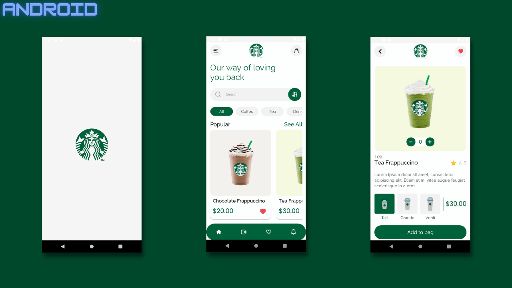

### Platforms

Android and iOS.

### Features:

* Use all new .NET MAUI APIs: Startup, HostBuilder, etc.
* Shadows.
* Borders.
* CommunityToolkit.Mvvm.
* CommunityToolkit.Maui.
* CommunityToolkit.Splat.

### More information:
- Author: [Satta Sundar](https://github.com/sattasundar)
- Source code: [https://github.com/sattasundar/maui-starbucks-ui](https://github.com/sattasundar/maui-starbucks-ui)

## [MAUI Payments with Prism](https://github.com/DamianSuess/Learn.MauiPaymentUi)

Dynamic Credit Card Payment UI using .NET MAUI and [Prism Library](https://github.com/PrismLibrary) and text-mask behaviors. This project is inspired by the CrossGeeks [project](https://github.com/CrossGeeks/PaymentUISample).

### Platforms

Android, iOS, Windows, Tizen

### Features

* Prism.MAUI
  * NavigationService
  * DryIoc Dependency Injection
  * MVVM
* Behaviors
* Custom Controls
* Styles
* XAML UI
* Credit Card Layout

### More Information

* **Source Code:** [https://github.com/DamianSuess/Learn.MauiPaymentUi]
* **Author:** Damian Suess - [Blog](https://suesslabs.com/) [GitHub](https://github.com/DamianSuess)

## [Bottom Sheets](https://github.com/PremSaiVarada/DemoCustomSheets)

Animated and customised Bottom Sheets plugin for .Net Maui UI [CustomSheets](https://www.nuget.org/packages/CustomSheets)

### Supported platforms
- [x] Android
- [?] iOS (Should work but I haven't tested)

### Features

* Fully customised
* We can change sheet height, width, background, RoundRectangle, background click to close, change the content for close button

### More Info

* How to use : [https://github.com/PremSaiVarada/DemoCustomSheets](https://github.com/PremSaiVarada/DemoCustomSheets)
* Author : [Prem V](https://github.com/PremSaiVarada/)

## [Coffeeffee](https://github.com/zdanovs/Coffeeffee-MAUI)

Implementation of a [coffee shopping UI](https://dribbble.com/shots/11246934-Product-Page-Ui-Exploration/attachments/2854822?mode=media) using .NET MAUI

### Supported platforms
- [x] iOS
- [x] Android

### Features
- CarouselView
- Custom Fonts
- Shapes

### More Info

- Source code: [https://github.com/zdanovs/Coffeeffee-MAUI](https://github.com/zdanovs/Coffeeffee-MAUI)
- Author: [Andrey Zhdanov](https://www.linkedin.com/in/zdanovs)
- Original author (of the Xamarin version): [Steven Thewissen](https://twitter.com/devnl)

## [BMI Calculator](https://github.com/naweed/MauiBMICalculator)

A simple and gorgeous BMI Calculator built using .NET MAUI and Skia Sharp. Inspired by this [Dribble Design](https://dribbble.com/shots/7735120-BMI-BMR-Calculator-App-Free-UI-Kit-1-Dribbble-Invitation).

### Platforms
- [x] iOS
- [x] Android

### Features:

* Use all new .NET MAUI APIs: Startup, HostBuilder, etc.
* SkiaSharp.

### More information:
- Author: [Naweed Akram](https://github.com/naweed)
- Source code: [https://github.com/naweed/MauiBMICalculator](https://github.com/naweed/MauiBMICalculator)

### Running App
https://user-images.githubusercontent.com/103980/185792503-6b6a8178-241a-4b50-99dd-68f73bbbc7ee.mp4

## [Band Tracker](https://github.com/michaldivis/band-tracker-app)

A demo music artist release and live show tracker app built with .NET MAUI.

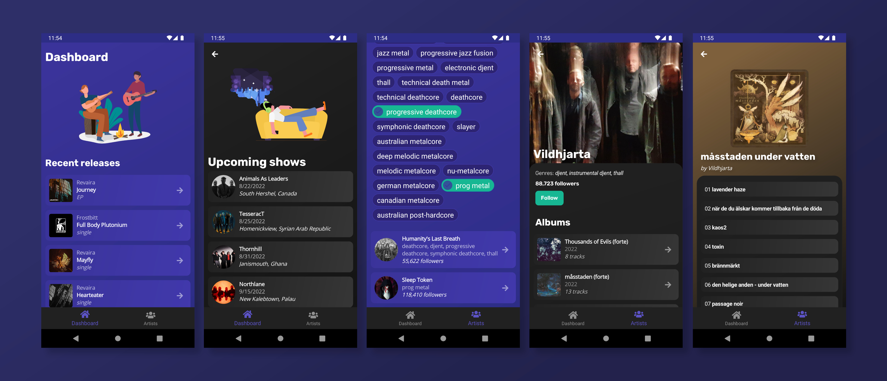

### Platforms
- [x] iOS
- [x] Android

### Features:

* Use all new .NET MAUI APIs: Startup, HostBuilder, etc.
* Gradients, Frames
* WebView
* SkiaSharp.Extended (Lottie animations)

### More information:
- Author: [Michal Diviš](https://github.com/michaldivis)
- Source code: [https://github.com/michaldivis/band-tracker-app](https://github.com/michaldivis/band-tracker-app)

### Running App
https://user-images.githubusercontent.com/45868547/186158735-c602c9d8-90da-4629-86c1-c06acdbeabd6.mp4

## [MAUI Focus](https://github.com/pedroldk/maui-focus)

A focus app using .NET MAUI.

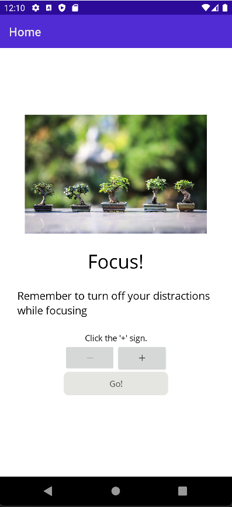

### Platforms

- [x] iOS
- [x] Android
- [x] Windows

### More information:
- Author: [Pedro Coelho](https://github.com/pedroldk)
- Source code: [https://github.com/pedroldk/maui-focus](https://github.com/pedroldk/maui-focus)

## [Medicine Tracker](https://github.com/thaveeshakannangara/MAUIBeautifulUIChallenge)

Implementation of a [Medicine tracker app UI](https://dribbble.com/shots/19130423-Medicine-reminder-mobile-app) using .NET MAUI

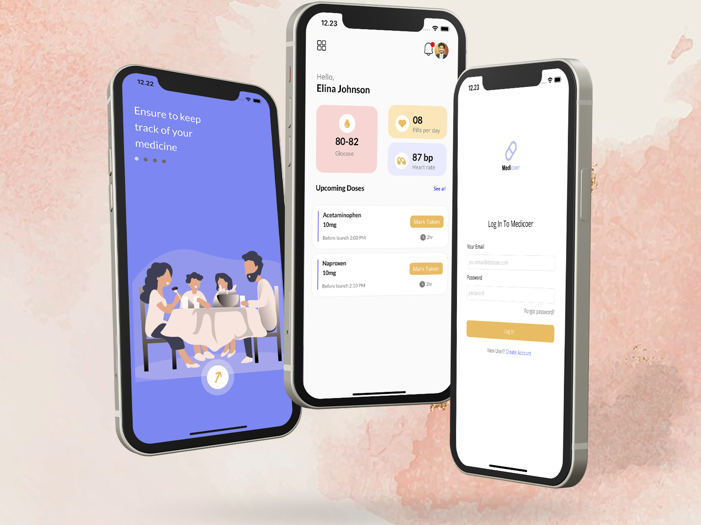

### Supported platforms
- [x] iOS
- [x] Android

### Features
- CarouselView
- IndicatorView
- CollectionView
- Custom Fonts
- Font Icons

### More Info

- Source code: [https://github.com/thaveeshakannangara/MAUIBeautifulUIChallenge](https://github.com/thaveeshakannangara/MAUIBeautifulUIChallenge)
- Author: [Thaveesha Kannangara](www.linkedin.com/in/thaveesha-kannangara)

## [PetAdoptionApp](https://github.com/JoeTomkinson/PetAdoptionApp)

Implementation of a [Pet Adoption app UI](https://dribbble.com/shots/15845064-Pet-Adoption-App) using .NET MAUI.  
Dribble by Arinasdd.

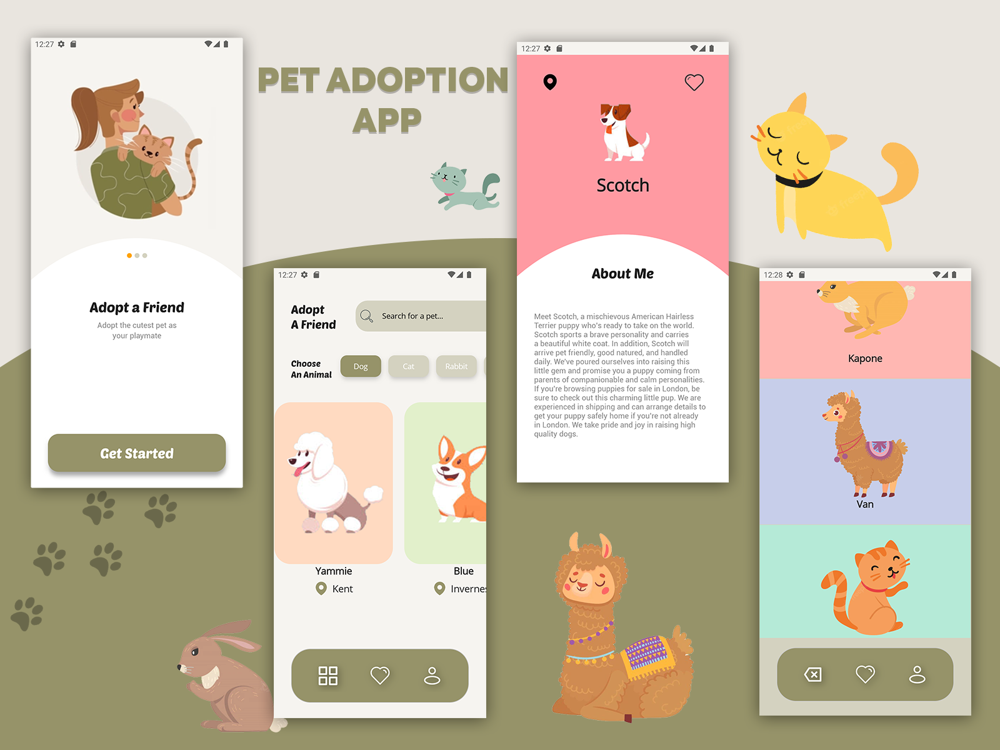

### Features
- CarouselView
- Custom Fonts
- MVVM
- DI
- MAUI Shapes

### More Info

- Source code: [https://github.com/JoeTomkinson/PetAdoptionApp](https://github.com/JoeTomkinson/PetAdoptionApp)
- Author: [Joe Tomkinson](https://joetomkinson.dev)

## [Real Estate App](https://github.com/marcfabregatb/RealEstate.App)

Having fun developing a Real Estate App for the UI Challenge made with .NET MAUI. 

## Preview

Based on this [design](https://dribbble.com/shots/15888343-Humz-Real-Estate-Mobile-App/attachments/7715467?mode=media) by [Jëlly](https://dribbble.com/ramadhanibsn).

### Supported platforms
- [x] iOS
- [x] Android

### Features:
- CarouselView
- IndicatorView
- CollectionView
- Custom Fonts
- Shadows.
- Borders.
- Gradients
- CommunityToolkit.Maui
- CommunityToolkit.Mvvm

### More information:
- Author: [Marc Fabregat](https://github.com/marcfabregatb) [twitter](https://twitter.com/Marcfabregatb)
- Source code: [https://github.com/marcfabregatb/RealEstate.App](https://github.com/marcfabregatb/RealEstate.App)

## [.NET MAUI Bank](https://github.com/VladislavAntonyuk/MauiSamples/tree/main/MauiBank)

Replicate the Ukrainian Monobank application UI using .NET MAUI.

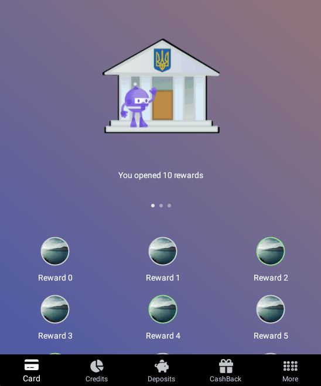

Based on this [design](https://dribbble.com/shots/4889186-Monobank-Enhancements).

### Platforms

Android, iOS, macOS and Windows.

### Features:

- Shell
- CarouselView
- CollectionView with grouping
- Pin Keyboard with Biometric Auth
- Credit Card Animation

### More information:
- Author: [Vladislav Antonyuk](https://github.com/VladislavAntonyuk)
- Source code: [https://github.com/VladislavAntonyuk/MauiSamples/tree/main/MauiBank](https://github.com/VladislavAntonyuk/MauiSamples/tree/main/MauiBank)

## [dotnet Maui memory game](https://github.com/jorgediegocrespo/MauiMemoryGame)

Classic memory game in which the user has to discover all the pairs of cards with the same images before time runs out. 
It allows the selection of different difficulty levels and different themes

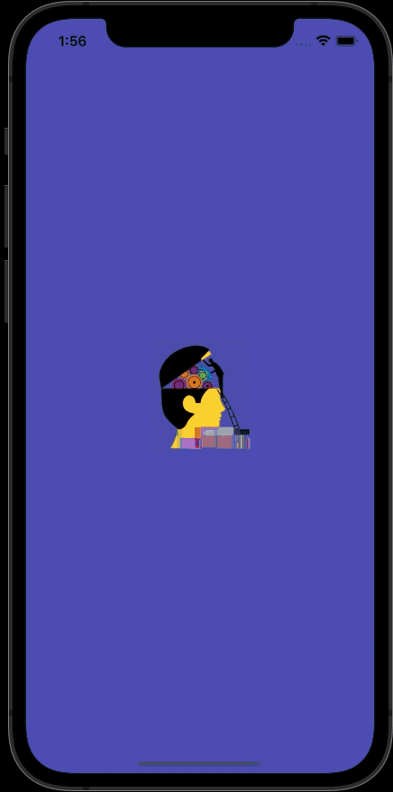
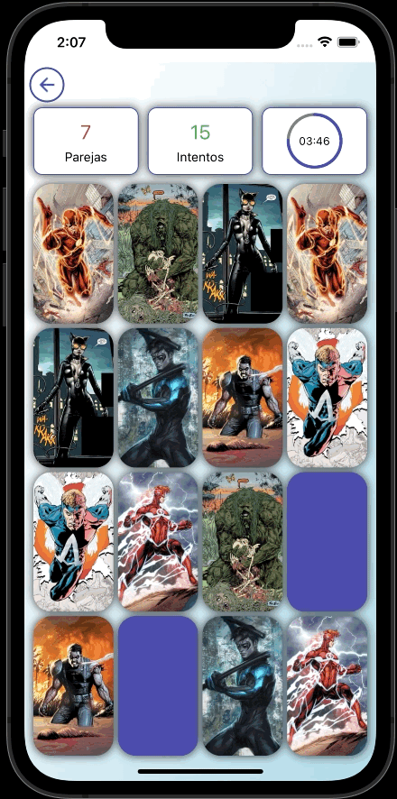
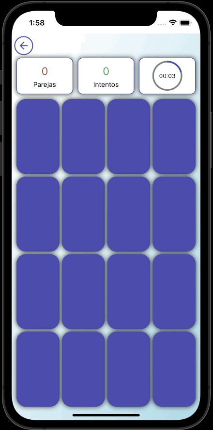

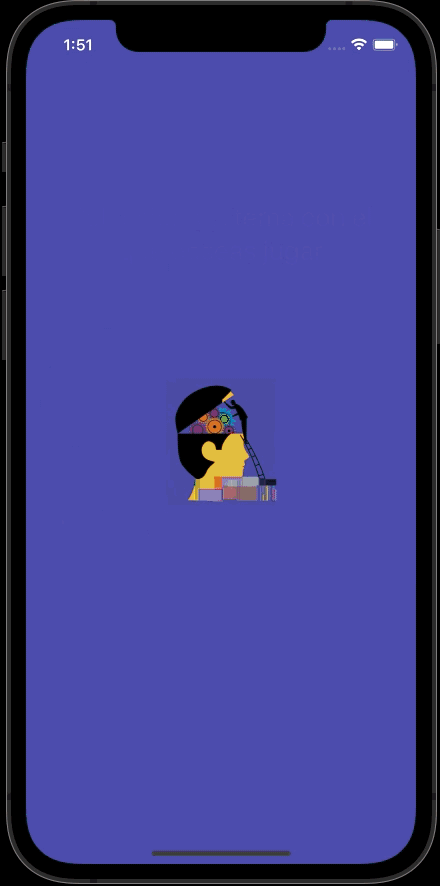
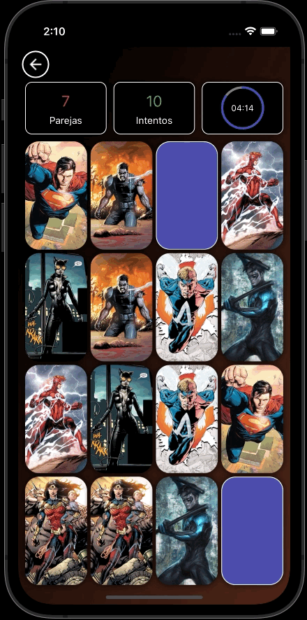
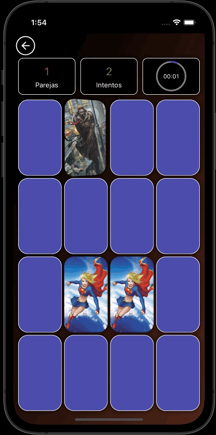

### Platforms

*   **iOS**
*   **Android**

It works only in portrait mode

### Features:

- Shell
- AppBuilder
- MVVM
- Animations
- Lottie
- Skia sharp
- Font icons
- Borders
- Shadows
- Color gradient brushes
- BindableLayout
- Dark and light themes

### More information:
- Author: [Jorge Diego Crespo](https://github.com/jorgediegocrespo)
- Source code: [https://github.com/jorgediegocrespo/MauiMemoryGame](https://github.com/jorgediegocrespo/MauiMemoryGame)

## [.NET MAUI Car Rent App](https://github.com/ahror1997/xaml-UI-maui)

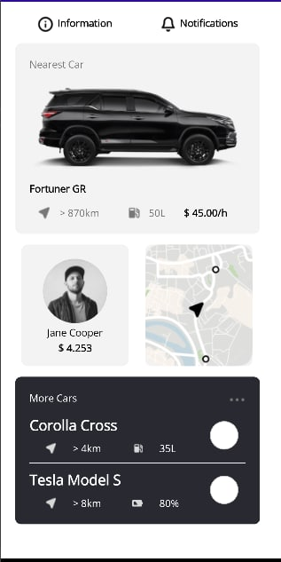

Based on this [design](https://www.figma.com/file/Jbz8W2sXm3LK7LIQHk4UHf/Car-Rent-App-(Community)?node-id=0%3A1).

### Platforms

Android, iOS, macOS and Windows.

### More information:
- Author: [Akhror Ziyodinov](https://github.com/ahror1997)

## [Maui Tube Player](https://github.com/naweed/MauiTubePlayer)
A REAL and BEAUTIFUL Youtube Clone app built using .Net Maui.

### Platforms
- [x] iOS
- [x] Android
- [x] Windows
- [x] MacOS

### Features:
* Use all new .NET MAUI APIs: Startup, HostBuilder, etc.
* Application Features:
- [X] Real Youtube API Connection
- [X] Search for videos
- [X] Infinite Scrolling
- [X] Video Details
- [X] Share a video
- [X] Play the video
- [X] Download the Video
- [X] And a nice UI Design

### More information:
- Author: [Naweed Akram](https://github.com/naweed)
- Source code: [https://github.com/naweed/MauiTubePlayer](https://github.com/naweed/MauiTubePlayer)

### Running App
https://user-images.githubusercontent.com/103980/186558099-59ded8cf-349f-4c98-aba2-9d569a18bb9e.mp4

## [MAUI Jass](https://github.com/Davidoutz/MAUI-Jass)
Multiplayer Swiss Jass game. [More info about the game](https://en.wikipedia.org/wiki/Jass#Schmaus)

### Running App
* Screenshot

* Video

### Platforms
- [x] iOS
- [X] Android
- [X] macOS

Windows has some buggy behaviors.

### Features:

- [X] MVVM/Community Toolkit
- [X] Animations
- [X] Fonts images
- [X] Messaging
- [X] Create/Join/Leave/Rejoin rooms
- [X] Official game rules
- [X] Multiplayers/Realtime communication (SignalR)
- [X] Blazor server backend on Azure 

### More information:
- Author: [David Beauverd](https://github.com/Davidoutz)
- Source code: [https://github.com/Davidoutz/MAUI-Jass](https://github.com/Davidoutz/MAUI-Jass)
- Extra: A new game starts automatically whenever 4 players join a room. Therefore you should use at least 4 devices/emulators for the best user experience :)

## [MAUIDelivery](https://github.com/hprez21/MAUIDelivery)

MAUIDelivery: A beautiful delivery .NET MAUI APP 

### Platforms

Android, iOS.

### Features:

* Use all new .NET MAUI APIs: Startup, HostBuilder, etc.
* Gradients
* Frames
* Custom Fonts
* SkiaSharp.Extended (Lottie Animations)
* Font Icons
* Borders
* DataTemplate Selectors
* Converters
* CollectionView with groups
* Animations
* DataTriggers

### More information:
- Author: [Héctor Pérez](https://github.com/hprez21)
- Blog post: [How was the MAUIDelivery application created?](https://devs.school/how-was-the-mauidelivery-application-created/)
- Source code: [https://github.com/hprez21/MAUIDelivery](https://github.com/hprez21/MAUIDelivery)

### Running App
https://user-images.githubusercontent.com/9836726/187584113-9e725430-562d-4d78-87e2-0affd2ede8e3.mp4

## [.NET MAUI Buy Used Car App](https://github.com/rvinothrajendran/BuyUsedCarApp)

### Platforms
Windows , Android, iOS, macOS.

### More information:
- Author: [Vinoth](https://github.com/rvinothrajendran)

## [Player Profile App](https://github.com/nikamvd/-.NET-MAUI-Beautiful-UI-Challenge-PlayerProfileApp)

App is specifically built for .NET MAUI Beautiful UI Challenge. Demonstrates building UI for iOS, Android, Mac and Windows from shared code base.

### Platforms
Android, iOS, macOS

### Features:
Demonstrates building UI for iOS, Android, Mac and Windows from shared code base.

### More information:
- Author: [Vinayak Nikam] (https://github.com/nikamvd)
- Source code: (https://github.com/nikamvd/-.NET-MAUI-Beautiful-UI-Challenge-PlayerProfileApp)

## [FLIPZON - Professional E-Commerce Application](https://github.com/learnToEarnWithSrikanth/FlipZon)

## Description
Welcome to FLIPZON, an advanced E-Commerce application developed using .NET MAUI. Inspired by the best features of Amazon and Flipkart, FLIPZON brings a seamless shopping experience to users. Leveraging the power of .NET 7, Prism Framework, and MVVM design pattern, FLIPZON integrates various UI controls, custom renders, and third-party libraries for a robust and user-friendly application.

## Features

- **Authentication:**
  - Secure and seamless login and signup screens.

- **Product Discovery:**
  - Intuitive home screen showcasing featured products.
  - Products screen with pagination for easy navigation.

- **Product Details:**
  - Detailed product information with a dedicated product details screen.

- **Search Functionality:**
  - Efficient search screen for finding desired products.

- **Shopping Cart:**
  - User-friendly cart screen for managing selected items.

- **Order Placement:**
  - Streamlined order placement process.

- **User Profile:**
  - Personalized profile screen for user customization.

- **Address Management:**
  - Address list screen and an option to add new addresses.

## Screens

- Login Screen
- SignUp Screen
- Home Screen
- Product Details Screen
- Products Screen
- Search Screen
- Cart Screen
- Address List Screen
- Add Address Screen
- Profile Screen
- Order Confirmation Screen

## Screenshots

| 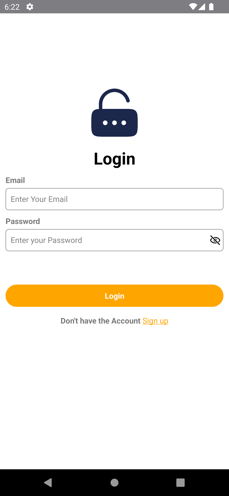 | 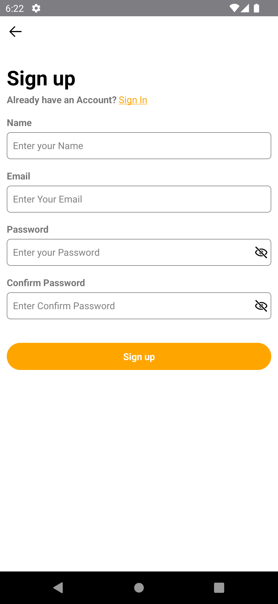 | 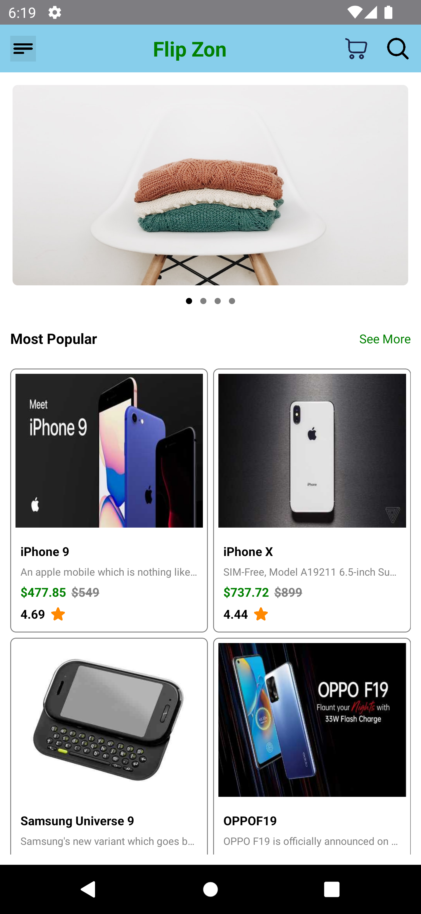 |
|:--:|:--:|:--:|
| *Login Screen* | *Signup Screen* | *Home Screen* |

| 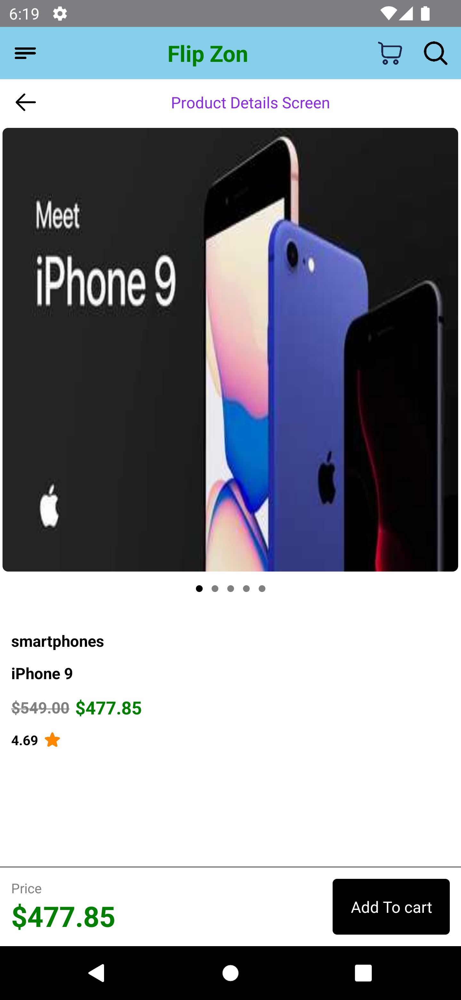 | 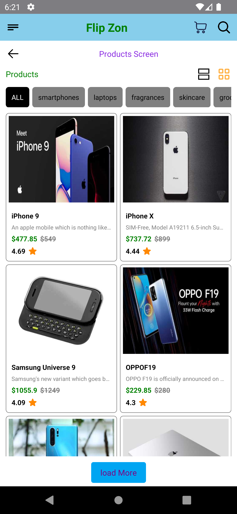 | 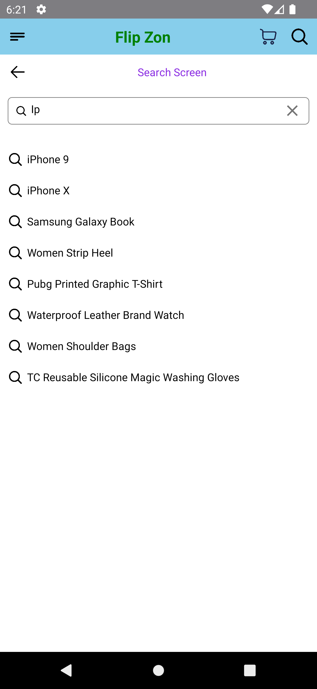 |
|:--:|:--:|:--:|
| *Details Screen* | *Products Screen* | *Search Screen* |

| 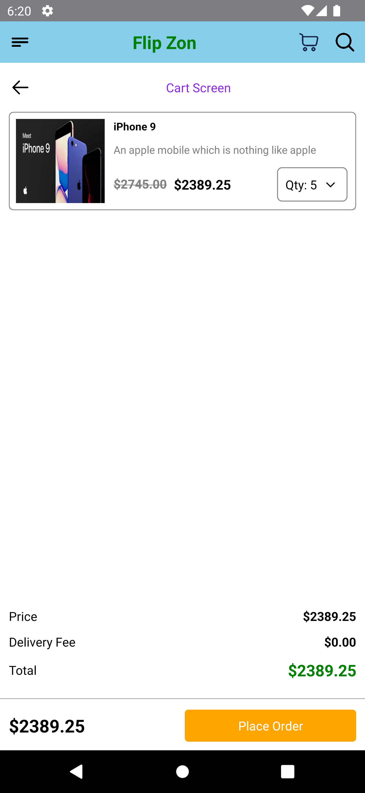 | 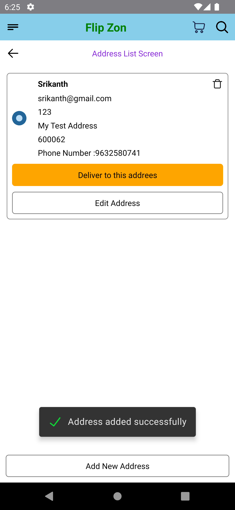 | 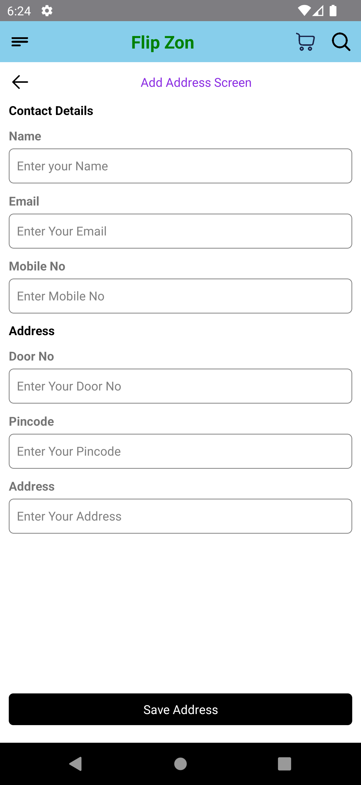 |
|:--:|:--:|:--:|
| *Cart Screen* | *Address List Screen* | *Add Address Screen* |

| 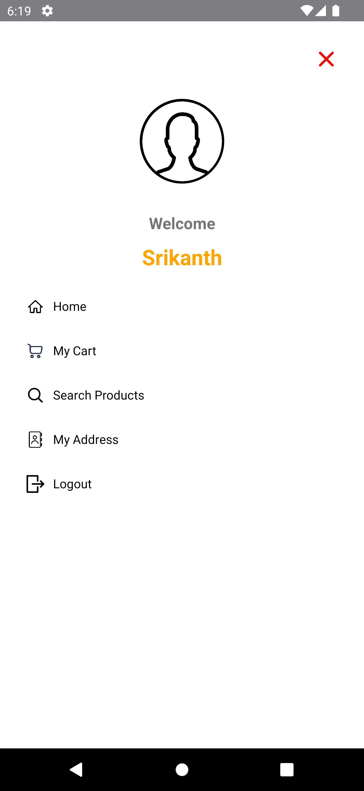 | 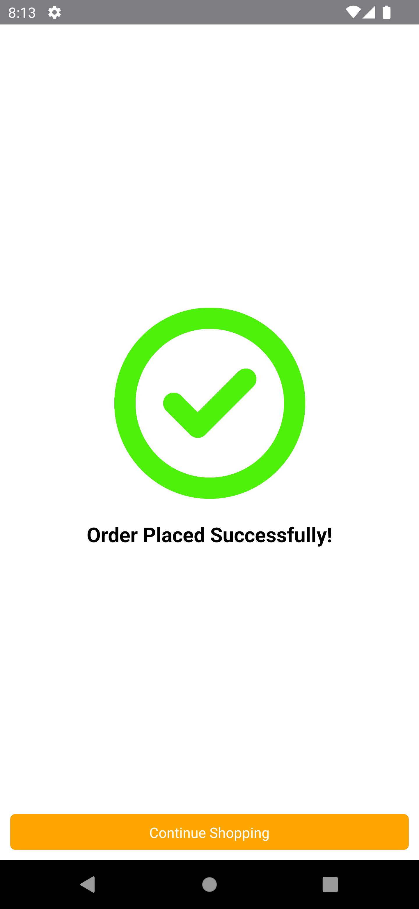 |
|:--:|:--:|
| *Profile Screen* | *Order Confirmation Screen* |

## Video Link

Check out our video tutorial for a quick overview of the project:

## UI Controls 

- Collection View
- Carousel View
- Swipe View
- Forms with Validation
- Custom Controls
- Custom Renders
- Pagination for products

## Tech Stack 

- **.NET MAUI:**
  - Cutting-edge framework for cross-platform app development.

- **Prism Framework:**
  - Implementing MVVM design pattern for a modular and maintainable codebase.

- **API Integration:**
  - Seamless integration with external APIs for up-to-date product information.

- **Database Integration:**
  - Utilizing SQLite PCL for efficient and reliable data storage.

## 3rd Party Libraries

1. **User Dialogs:**
   - For Alerts and confirmations Popups.

2. **Mopups:**
   - To display popups.

3. **Community Toolkit:**
   - For Form Validations and Converters

4. **SQLite PCL:**
   - For Database support
     
## More information:
- Author: [Srikanth Rachaputi] (https://github.com/learnToEarnWithSrikanth)
- Source code: (https://github.com/learnToEarnWithSrikanth/FlipZon)

## [NightClub](https://github.com/Kapusch/blog-dotnet-maui/tree/main/Samples/NightClub)

Learn .NET MAUI quickly & simply with my first class for beginners (100% free!). 🐒 

"My First App", it’s 15 articles, nearly 3 hours of reading... and a highly colorful music application!! 🎶 🎉

➡️ https://www.mauicestclair.fr/en/posts/tutos/my-first-app/

🇫🇷 Also available in French!

## Images Preview

## Platforms
iOS, Android, macOS and Windows

## Features
- C# Markup
- MVVM
- MediaElement
- Animations

## More Information
- Author: [Jean-Emmanuel Baillat](https://github.com/Kapusch)
- Source Code: https://github.com/Kapusch/blog-dotnet-maui/tree/main/Samples/NightClub
